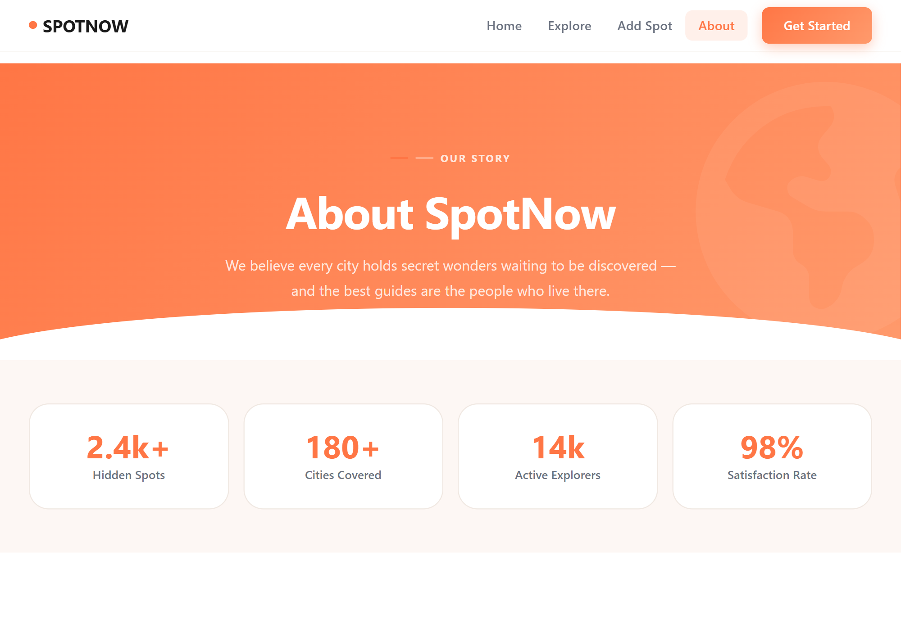
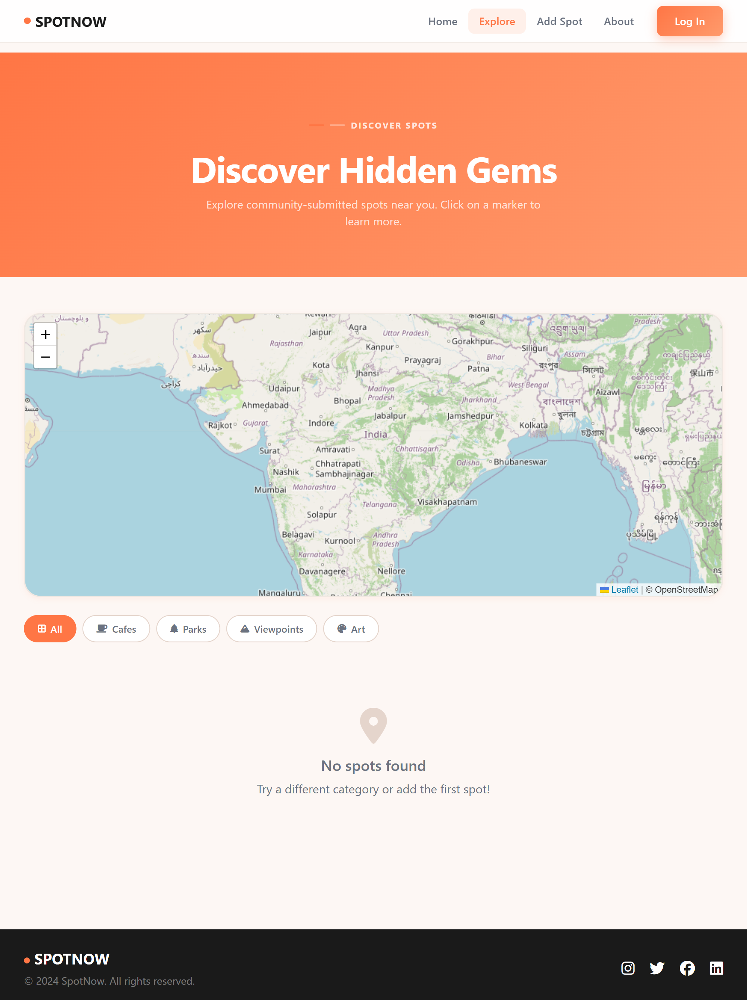
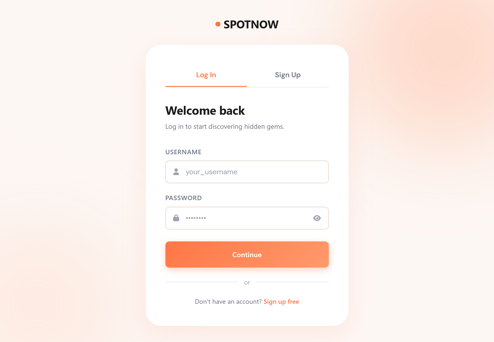

# SpotNow - Discover hidden gems of your city

SpotNow is a modern, community-driven city discovery platform designed to help users find and share "hidden gems"—unique, lesser-known locations such as tucked-away cafés, secret gardens, rooftop views, and street art. The project connects local explorers with travelers by providing an interactive, map-based interface for authentic urban exploration.

## Live Demo

https://spotnow-backend.netlify.app/

## Preview

## Problem Statement

Urban exploration and city discovery are currently dominated by mass-market navigation tools and commercial review platforms. While these tools are excellent for finding popular businesses, they are built on algorithms that prioritize high-traffic, commercialized locations over authentic local culture.

There is a significant "Discovery Gap" in modern urban navigation. Residents and travelers frequently miss out on unique "hidden gems"—such as tucked-away cafés, secret gardens, or local art—because these spots lack the marketing budget to compete for visibility on major platforms.

Furthermore, existing social sharing often lacks geospatial precision. Users may see a photo of a beautiful location online but struggle to find its exact coordinates or authentic "insider" tips on how to access it.

To solve this, a platform must address several key technical hurdles:

Trust & Verification: The need for a secure authentication system to ensure contributions come from a     verified community rather than bots.  

Geospatial Accuracy: Providing a way for users to pinpoint exact locations on a map rather than relying on generic addresses.

Privacy & Exclusivity: Managing access so that the community-curated data is protected from unauthorized scraping or public exploitation.

## Solution

SpotNow addresses these issues by providing a secure, community-driven platform that utilizes interactive mapping (Leaflet.js) and cloud-based storage (MongoDB). By allowing users to precisely pin locations and share visual evidence, the platform decentralizes city discovery and places the power of "hidden gem" curation back into the hands of local explorers.

## Tech Stack

Frontend (Client-Side)
- Languages: HTML5, CSS3, and JavaScript (ES6+).
- Framework: Bootstrap 5.3.6 for responsive layout and pre-built UI components.
- Icons: Font Awesome 6.7.2 for scalable vector icons.
- Design System: Custom Glassmorphism styles utilizing CSS variables, backdrop filters, and soft gradients.
- State Management: LocalStorage for maintaining user authentication status across sessions.

Backend (Server-Side)
- Environment: Node.js for the runtime environment.  
- Web Framework: Express for handling RESTful API routes and middleware.  
- File Handling: Multer for processing multipart/form-data, specifically for user image uploads.  
- Security: Bcryptjs for secure, one-way password hashing before database storage.  
- Environment Configuration: Dotenv to securely manage sensitive API keys and connection strings.  

Database & Storage
- Primary Database: MongoDB Atlas (Cloud NoSQL database).  
- Object Modeling: Mongoose for defining schemas and interacting with MongoDB.  
- File Storage: Local Server Disk (Render ephemeral storage) for images.

Deployment & Infrastructure
- Frontend Hosting: Netlify for high-speed delivery of static assets and frontend logic.
- Backend Hosting: Render for managing the live Node.js web service and API endpoints.
- Version Control: Git for source code management and deployment triggers.

